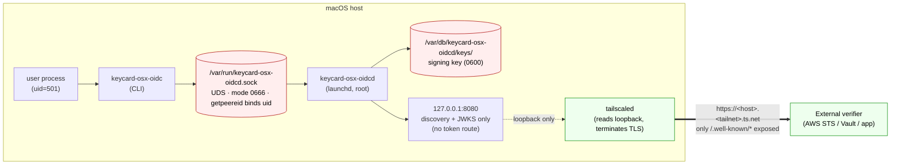

# keycard-osx-oidc

A local OIDC issuer for macOS. Each user on the host can mint a signed JWT
representing their identity; external services (AWS STS, Vault, custom apps)
trust those tokens by fetching the issuer's JWKS over the network. The model
mirrors EKS IRSA: **token issuance is internal/local, discovery + JWKS are
public**.

## Components

- **`keycard-osx-oidcd`** — privileged daemon, loaded by launchd as `root`.
  Listens on a Unix socket for token requests (UID-bound via `getpeereid`)
  and on `127.0.0.1:8080` for discovery + JWKS.
- **`keycard-osx-oidc`** — unprivileged user CLI. `keycard-osx-oidc token
  --audience <aud>` returns a signed JWT.

## Network exposure



| Endpoint | Bound to | Reachable from | Carries token? |
|---|---|---|---|
| `/var/run/keycard-osx-oidcd.sock` | filesystem (UDS) | only processes on this Mac | yes — mints JWTs |
| `127.0.0.1:8080/.well-known/openid-configuration` | loopback TCP | only this Mac (incl. `tailscaled`) | no |
| `127.0.0.1:8080/.well-known/jwks.json` | loopback TCP | only this Mac (incl. `tailscaled`) | no — public key only |
| `127.0.0.1:8080/healthz` | loopback TCP | only this Mac | no |
| `https://<host>.<tailnet>.ts.net/.well-known/*` | `tailscaled` (`serve`/`funnel`) | tailnet peers (`serve`) or public Internet (`funnel`) | no — public key only |

## Security boundary: why remote callers cannot mint tokens

Three independent guarantees, any one of which is sufficient:

1. **No token route on the HTTP server.** The discovery server registers
   exactly three handlers: `/.well-known/openid-configuration`,
   `/.well-known/jwks.json`, `/healthz`. There is no `/token`,
   `/oauth/token`, or equivalent. Tailscale can only proxy what the HTTP
   listener exposes, and the HTTP listener exposes no way to mint a token.
   See `crates/oidcd/src/discovery.rs::router`.
2. **Token issuance lives on a Unix socket.** `/var/run/keycard-osx-oidcd.sock`
   is a filesystem object, not a network endpoint. Tailscale `serve`/`funnel`
   only proxies TCP listeners; it has no way to forward to a UDS. The
   network stack literally cannot reach this socket.
3. **Identity is asserted by the kernel.** When a process connects to the
   UDS the daemon calls `getpeereid()` on the accepted fd — the kernel
   reports the connecting process's UID, the client cannot influence it.
   The minted JWT's `sub`/`uid`/`username` claims are derived from that
   kernel-asserted UID, not from anything in the request body.

Defence in depth:

- The HTTP listener defaults to `127.0.0.1:8080`. The daemon emits a
  `WARN` log on startup if `listen_http` is configured to bind to a
  non-loopback address (see `is_loopback_listen` in `crates/oidcd/src/main.rs`).
- The signing key file (`/var/db/keycard-osx-oidcd/keys/current.json`) is
  mode `0600` owned by `root`. Only the daemon can read it; the public
  side is published in JWKS without `d`.

The intended threat model: any process on the Mac can request a token, but
the token it gets back is bound to that process's own UID — it cannot
impersonate another user. Off-host callers can only fetch the public JWKS,
which is exactly what verifiers need to validate tokens but cannot use to
mint new ones.

## Token shape

```json
{
  "iss": "https://<host>.<tailnet>.ts.net",
  "sub": "<machine_uuid>:<uid>",
  "aud": "sts.amazonaws.com",
  "iat": 1700000000,
  "nbf": 1700000000,
  "exp": 1700003600,
  "uid": 501,
  "username": "kamil",
  "hostname": "kamils-macbook",
  "machine_id": "C0FFEE-..."
}
```

Signed with Ed25519 (`alg=EdDSA`). The `kid` in the header is the RFC 7638
JWK thumbprint of the signing key. Keys rotate every 7 days; the previous
key stays in JWKS for a 24h grace window.

## Quickstart (macOS)

```bash
# Build, install, and load the daemon
cargo build --release
sudo ./packaging/install.sh

# Edit issuer URL to match your Tailscale hostname
sudo vi /etc/keycard-osx-oidcd/config.toml
sudo launchctl kickstart -kp system/com.keycard.osx-oidcd

# Expose discovery via Tailscale
sudo tailscale serve --bg --https=443 http://127.0.0.1:8080

# Mint a token as a regular user
keycard-osx-oidc whoami
keycard-osx-oidc token --audience sts.amazonaws.com
```

See [ADMIN.md](ADMIN.md) for the full deployment, verification, upgrade, and
uninstall runbook.

## Layout

| Path | Purpose |
|------|---------|
| `crates/oidc-core/` | JWK/JWKS, JWT sign/verify, claims, discovery doc |
| `crates/oidcd/` | The `keycard-osx-oidcd` daemon binary |
| `crates/cli/` | The `keycard-osx-oidc` user CLI binary |
| `packaging/` | LaunchDaemon plist, install/uninstall scripts, example config |

## License

MIT. See [LICENSE](LICENSE).
